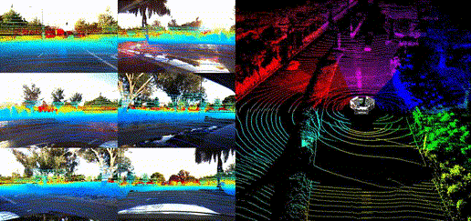

[](https://www.tri.global/)

# DDAD - Dense Depth for Autonomous Driving 

- [How to Use](#how-to-use)
- [Specifications](#specifications)
- [CVPR 2020 Workshop Challenge](#cvpr-2020-workshop-challenge)
- [License](#license)
- [References](#references)

DDAD is a new urban driving dataset with more challenging and accurate depth evaluation, thanks to longer-range and denser ground-truth depth  generated  from  high-density  LiDARs  mounted  on a fleet of self-driving cars operating in a cross-continental setting. It contains scenes from urban settings in the United States (San Francisco Bay Area, Detroit and Ann Arbor) and Japan (Tokyo and Odaiba). The depth maps generated from projecting these Luminar pointclouds onto the camera frame allow us to evaluate depth estimation methods in a much more challenging way, both in terms of denseness and longer ranges. 



## How to Use

Dataset links, alongside the development tools necessary to load and process the data, will be provided in the upcoming weeks. 

## Specifications

DDAD includes a high-resolution, long-range [Luminar-H2](https://www.luminartech.com/technology) as the LiDAR sensor used to generate pointclouds, with a maximum range of 250m and sub-1cm range precision. Additionally, it contains six calibrated cameras time-synchronized at 10 Hz, that together produce a 360 degree coverage around the vehicle. Each scene is 5 or 10 seconds long and consists of 50 or 100 samples with corresponding Luminar-H2 pointcloud and six image frames, including intrinsic and extrinsic calibration. The training set contains 194 scenes with a total of 17050 individual samples, and the validation set contains 60 senes with a total of 4150 samples. The six cameras are 2.4MP (1936 x 1216), global-shutter, and oriented at 60 degree intervals. They are synchronized with 10 Hz scans from our Luminar-H2 sensors oriented at 90 degree intervals.}


## CVPR 2020 Workshop Challenge

To evaluate the current state-of-the-art in monocular depth estimation, the upcoming CVPR 2020 workshop [**Frontiers of Monocular 3D Perception**](https://sites.google.com/view/mono3d-workshop/home) will include a challenge involving DDAD. More information on the website.

## License

The DDAD dataset, alongside the development code provided for its use, is released under the [MIT license](LICENSE.md).

## References

Please use the following citation when referencing DDAD:

#### 3D Packing for Self-Supervised Monocular Depth Estimation (CVPR 2020 oral) 
*Vitor Guizilini, Rares Ambrus, Sudeep Pillai, Allan Raventos and Adrien Gaidon*, [**[paper]**](https://arxiv.org/abs/1905.02693), [**[video]**](https://www.youtube.com/watch?v=b62iDkLgGSI)
```
@inproceedings{packnet,
  author = {Vitor Guizilini and Rares Ambrus and Sudeep Pillai and Allan Raventos and Adrien Gaidon},
  title = {3D Packing for Self-Supervised Monocular Depth Estimation},
  booktitle = {IEEE Conference on Computer Vision and Pattern Recognition (CVPR)},
  primaryClass = {cs.CV}
  year = {2020},
}
```
